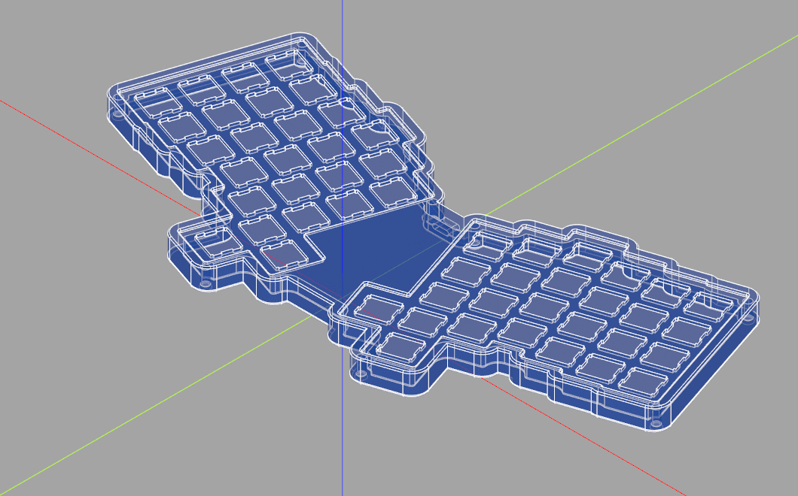
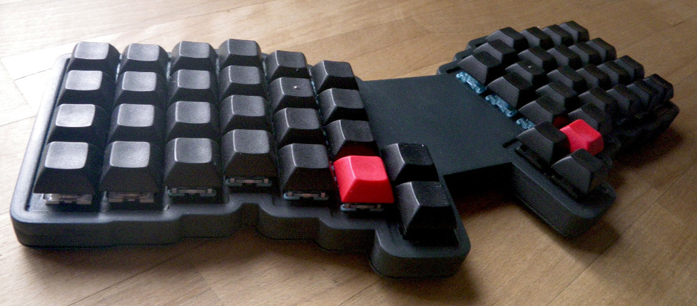

# CadQuery 2 keyboard case generator

## :warning: This is an experimental project
## :warning: Be careful when using the generated files

More [here](GALLERY.md).
For STL files got to the `Actions` tab.

First 3D-printed keyboard build using this project:

# TODO

  - [x] adding USB connector cutout
